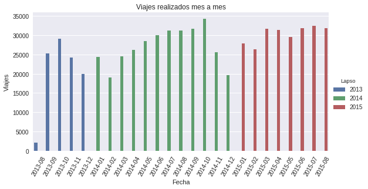
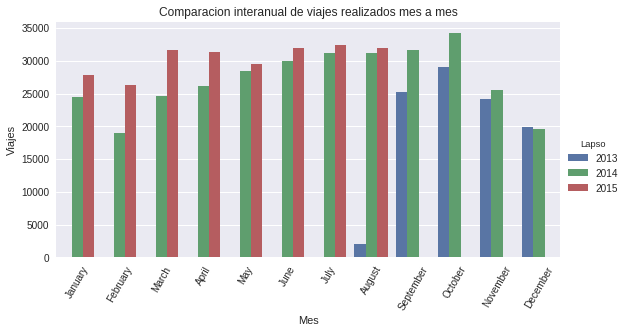
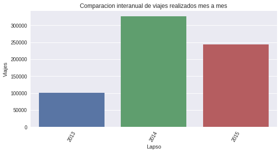
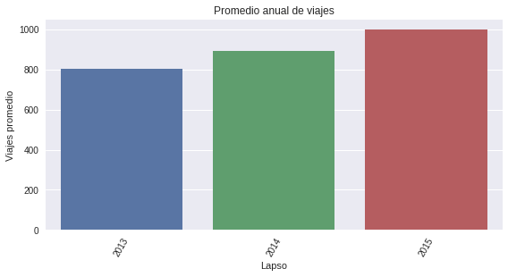
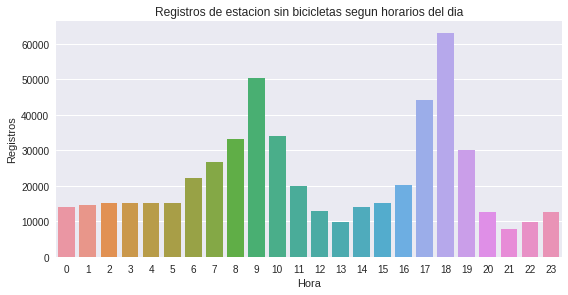
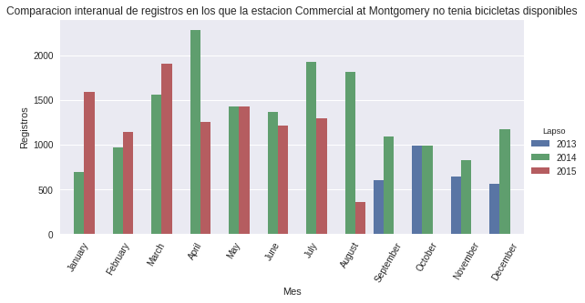
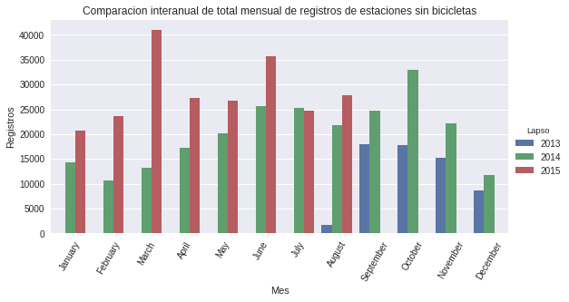

```python
import pandas as pd
import numpy as np
from datetime import datetime
import matplotlib.pyplot as plt
from datetime import timedelta, date
import matplotlib.dates as mdates
import seaborn as sns

%matplotlib inline
```


```python
#Cargo datos de viajes
tripsDf = pd.read_csv("data/trip.csv")
#Cargo datos de estaciones
stationsDf = pd.read_csv('data/station.csv')
```


```python
#Analizo los tipos de datos de trips
tripsDf.dtypes
```


    id                     int64
    duration               int64
    start_date            object
    start_station_name    object
    start_station_id       int64
    end_date              object
    end_station_name      object
    end_station_id         int64
    bike_id                int64
    subscription_type     object
    zip_code              object
    dtype: object


```python
#Convierto datos de fechas a datetime
tripsDf['start_date'] = pd.to_datetime(tripsDf['start_date'], format = "%m/%d/%Y %H:%M")
tripsDf['end_date'] = pd.to_datetime(tripsDf['end_date'], format = "%m/%d/%Y %H:%M")
```


```python
#Creo columna solo con datos de la fecha de inicio
tripsDf['date'] = tripsDf['start_date'].map(lambda x: x.date())
```


```python
#Agrego columnas con el año y el mes
tripsDf['year'] = tripsDf['date'].map(lambda x: x.year)
tripsDf['month'] = tripsDf['date'].map(lambda x: x.month)
tripsDf['day'] = tripsDf['date'].map(lambda x: x.day)
```


```python
#Agrego columnas solo con el día, y otro con formato año-mes
tripsDf['year-month'] = tripsDf['start_date'].map(lambda x: x.strftime('%Y-%m'))
```


```python
#Analizo los datos de stations
stationsDf.dtypes
```


    id                     int64
    name                  object
    lat                  float64
    long                 float64
    dock_count             int64
    city                  object
    installation_date     object
    dtype: object


```python
#Cambio el nombre de la columna id a station_id por claridad
stationsDf.rename(columns={'id':'station_id'}, inplace=True)
```

# ¿Cómo evoluciona con el tiempo la cantidad de viajes?

Se realizará un análisis de la cantidad de viajes utilizando los datos de los mismos entre Agosto del 2013 y Agosto del 2015, con el fin de determinar cómo se comporta la demanda del servicio en el tiempo.

### Top 5 de días con más viajes


```python
#Viajes por fecha
tripsPerDay = pd.DataFrame({'count' : tripsDf.groupby(['date']).size()}).reset_index()
```


```python
#Top 5 de días con más viajes
tripsPerDay.sort_values(by='count', ascending=False).head(5)
```


<div>
<table border="1" class="dataframe">
  <thead>
    <tr style="text-align: right;">
      <th></th>
      <th>date</th>
      <th>count</th>
    </tr>
  </thead>
  <tbody>
    <tr>
      <th>382</th>
      <td>2014-09-15</td>
      <td>1516</td>
    </tr>
    <tr>
      <th>362</th>
      <td>2014-08-26</td>
      <td>1513</td>
    </tr>
    <tr>
      <th>426</th>
      <td>2014-10-29</td>
      <td>1496</td>
    </tr>
    <tr>
      <th>411</th>
      <td>2014-10-14</td>
      <td>1496</td>
    </tr>
    <tr>
      <th>363</th>
      <td>2014-08-27</td>
      <td>1479</td>
    </tr>
  </tbody>
</table>
</div>


### Cantidad de viajes, mes a mes


```python
#Plot de viajes por mes
monthlyTrips = tripsDf
monthlyTrips = pd.DataFrame({'count' : tripsDf.groupby(['year', 'month', 'year-month']).size()}).reset_index()
monthlyTrips = monthlyTrips.loc[:, ['count', 'year-month', 'year', 'month']]
monthlyTrips.rename(columns={'count':'Viajes', 'month':'Mes', 'year':'Lapso', 'year-month':'Fecha'}, inplace=True)

g = sns.factorplot(x='Fecha', y='Viajes', hue='Lapso', data=monthlyTrips, kind = 'bar', size=4, aspect = 2)
g.axes.flat[0].set_title('Viajes realizados mes a mes')
g.set_xticklabels(rotation=60)
```


    <seaborn.axisgrid.FacetGrid at 0x7fd2cd150650>





### Comparación interanual de viajes mensuales


```python
#Plot de viajes por mes
monthlyTrips = tripsDf
monthlyTrips = pd.DataFrame({'count' : tripsDf.groupby(['year', 'month','date']).size()}).reset_index()
monthlyTrips['month_name'] = monthlyTrips['date'].map(lambda x: x.strftime('%B'))
monthlyTrips = monthlyTrips.groupby(['month', 'year', 'month_name']).sum()
monthlyTrips = monthlyTrips.reset_index()

monthlyTrips.rename(columns={'count':'Viajes', 'month_name':'Mes', 'year':'Lapso'}, inplace=True)

g = sns.factorplot(x='Mes', y='Viajes', hue='Lapso', data=monthlyTrips, kind = 'bar', size=4, aspect = 2)
g.axes.flat[0].set_title('Comparacion interanual de viajes realizados mes a mes')
g.set_xticklabels(rotation=60)
```


    <seaborn.axisgrid.FacetGrid at 0x7fd2cc543ed0>





### Viajes por año


```python
#Viajes por año
yearTrips = tripsDf
yearTrips = pd.DataFrame({'count' : tripsDf.groupby(['year']).size()}).reset_index()
yearTrips.rename(columns={'count':'Viajes', 'year':'Lapso'}, inplace=True)

g = sns.factorplot(x='Lapso', y='Viajes', data=yearTrips, kind = 'bar', size=4, aspect = 2)
g.axes.flat[0].set_title('Comparacion interanual de viajes realizados mes a mes')
g.set_xticklabels(rotation=60)
```


    <seaborn.axisgrid.FacetGrid at 0x7fd2cc5f6590>





### Viajes promedio por año


```python
#Viajes promedio por año
yearAverageTrips = pd.DataFrame({'count' : tripsDf.groupby(['year']).size(),\
                             'days' : tripsDf.groupby(['year']).date.nunique(),\
                             'average_trips' : tripsDf.groupby(['year']).size()/tripsDf.groupby(['year']).date.nunique()}).reset_index()

yearAverageTrips.rename(columns={'year':'Lapso', 'average_trips':'Viajes promedio'}, inplace=True)

g = sns.factorplot(x='Lapso', y='Viajes promedio', data=yearAverageTrips, kind = 'bar', size=4, aspect = 2)
g.axes.flat[0].set_title('Promedio anual de viajes')
g.set_xticklabels(rotation=60)
```


    <seaborn.axisgrid.FacetGrid at 0x7fd2c4a614d0>





# ¿Cómo se satisface la demanda del servicio?

Se analizará utilizando los datos minuto a minuto de las estaciones, en cuántas oportunidades se encontraban sin bicicletas disponibles.


```python
#Obtenemos los datos en los que alguna estación se quedó sin bicicletas
df = []
for chunk in pd.read_csv('data/status.csv', chunksize=1000000):
    df.append(chunk[chunk.bikes_available == 0])
emptyStationDf = pd.concat(df)
```


```python
emptyStationDf.size
```


    2116016


```python
emptyStationDf.dtypes
```


    station_id          int64
    bikes_available     int64
    docks_available     int64
    time               object
    dtype: object


```python
#Convierto a fecha el dato de time
emptyStationDf['time'] = pd.to_datetime(emptyStationDf['time'], format = "%Y/%m/%d %H:%M:%S")

#Agrego columnas para el año, mes, día y hora
emptyStationDf['year'] = emptyStationDf['time'].map(lambda x: x.year)
emptyStationDf['month'] = emptyStationDf['time'].map(lambda x: x.month)
emptyStationDf['day'] = emptyStationDf['time'].map(lambda x: x.day)
emptyStationDf['hour'] = emptyStationDf['time'].map(lambda x: x.hour)
```


```python
#Combino datos de estaciones vacías con los datos de las estaciones
emptyStationDf = emptyStationDf.merge(stationsDf, on='station_id')
```


```python
emptyStationDf.head(1)
```


<div>
<table border="1" class="dataframe">
  <thead>
    <tr style="text-align: right;">
      <th></th>
      <th>station_id</th>
      <th>bikes_available</th>
      <th>docks_available</th>
      <th>time</th>
      <th>year</th>
      <th>month</th>
      <th>day</th>
      <th>hour</th>
      <th>name</th>
      <th>lat</th>
      <th>long</th>
      <th>dock_count</th>
      <th>city</th>
      <th>installation_date</th>
    </tr>
  </thead>
  <tbody>
    <tr>
      <th>0</th>
      <td>2</td>
      <td>0</td>
      <td>27</td>
      <td>2013-11-03 02:00:01</td>
      <td>2013</td>
      <td>11</td>
      <td>3</td>
      <td>2</td>
      <td>San Jose Diridon Caltrain Station</td>
      <td>37.329732</td>
      <td>-121.901782</td>
      <td>27</td>
      <td>San Jose</td>
      <td>8/6/2013</td>
    </tr>
  </tbody>
</table>
</div>


### ¿Qué estaciones informaron más veces que no tenían bicicletas?


```python
moreTimesEmpty = emptyStationDf.groupby("name", as_index=False).size()
moreTimesEmpty.name = 'count'
moreTimesEmpty = moreTimesEmpty.reset_index()

#Estaciones más veces vacías
moreTimesEmpty = moreTimesEmpty.merge(stationsDf, on='name')
moreTimesEmpty = moreTimesEmpty.loc[:, ['station_id', 'name', 'city', 'count', 'dock_count']].sort_values(by='count', ascending=False)
moreTimesEmpty.head(10)
```


<div>
<table border="1" class="dataframe">
  <thead>
    <tr style="text-align: right;">
      <th></th>
      <th>station_id</th>
      <th>name</th>
      <th>city</th>
      <th>count</th>
      <th>dock_count</th>
    </tr>
  </thead>
  <tbody>
    <tr>
      <th>12</th>
      <td>45</td>
      <td>Commercial at Montgomery</td>
      <td>San Francisco</td>
      <td>29198</td>
      <td>15</td>
    </tr>
    <tr>
      <th>28</th>
      <td>76</td>
      <td>Market at 4th</td>
      <td>San Francisco</td>
      <td>24725</td>
      <td>19</td>
    </tr>
    <tr>
      <th>18</th>
      <td>48</td>
      <td>Embarcadero at Vallejo</td>
      <td>San Francisco</td>
      <td>24401</td>
      <td>15</td>
    </tr>
    <tr>
      <th>0</th>
      <td>62</td>
      <td>2nd at Folsom</td>
      <td>San Francisco</td>
      <td>24077</td>
      <td>19</td>
    </tr>
    <tr>
      <th>17</th>
      <td>60</td>
      <td>Embarcadero at Sansome</td>
      <td>San Francisco</td>
      <td>23143</td>
      <td>15</td>
    </tr>
    <tr>
      <th>49</th>
      <td>70</td>
      <td>San Francisco Caltrain (Townsend at 4th)</td>
      <td>San Francisco</td>
      <td>21726</td>
      <td>19</td>
    </tr>
    <tr>
      <th>22</th>
      <td>73</td>
      <td>Grant Avenue at Columbus Avenue</td>
      <td>San Francisco</td>
      <td>20739</td>
      <td>15</td>
    </tr>
    <tr>
      <th>11</th>
      <td>41</td>
      <td>Clay at Battery</td>
      <td>San Francisco</td>
      <td>19080</td>
      <td>15</td>
    </tr>
    <tr>
      <th>7</th>
      <td>82</td>
      <td>Broadway St at Battery St</td>
      <td>San Francisco</td>
      <td>17824</td>
      <td>15</td>
    </tr>
    <tr>
      <th>1</th>
      <td>64</td>
      <td>2nd at South Park</td>
      <td>San Francisco</td>
      <td>17111</td>
      <td>15</td>
    </tr>
  </tbody>
</table>
</div>


### ¿En qué horarios se da mayormente que no haya bicicletas?


```python
hoursEmpty = emptyStationDf.groupby("hour", as_index=False).size()
hoursEmpty.name = 'count'
hoursEmpty = hoursEmpty.reset_index()

#Estaciones más veces vacías
hoursEmpty = hoursEmpty.loc[:, ['hour', 'count']].sort_values(by='count', ascending=False)
hoursEmpty.head(10)
```


<div>
<table border="1" class="dataframe">
  <thead>
    <tr style="text-align: right;">
      <th></th>
      <th>hour</th>
      <th>count</th>
    </tr>
  </thead>
  <tbody>
    <tr>
      <th>18</th>
      <td>18</td>
      <td>63200</td>
    </tr>
    <tr>
      <th>9</th>
      <td>9</td>
      <td>50322</td>
    </tr>
    <tr>
      <th>17</th>
      <td>17</td>
      <td>44140</td>
    </tr>
    <tr>
      <th>10</th>
      <td>10</td>
      <td>34089</td>
    </tr>
    <tr>
      <th>8</th>
      <td>8</td>
      <td>33174</td>
    </tr>
    <tr>
      <th>19</th>
      <td>19</td>
      <td>29980</td>
    </tr>
    <tr>
      <th>7</th>
      <td>7</td>
      <td>26784</td>
    </tr>
    <tr>
      <th>6</th>
      <td>6</td>
      <td>22234</td>
    </tr>
    <tr>
      <th>16</th>
      <td>16</td>
      <td>20285</td>
    </tr>
    <tr>
      <th>11</th>
      <td>11</td>
      <td>19973</td>
    </tr>
  </tbody>
</table>
</div>


```python
#Grafico de los datos de registros por hora
hoursEmpty.rename(columns={'hour':'Hora', 'count':'Registros'}, inplace=True)
g = sns.factorplot(x='Hora', y='Registros', data=hoursEmpty, kind = 'bar', size=4, aspect = 2)
g.axes.flat[0].set_title('Registros de estacion sin bicicletas segun horarios del dia')

```


    <matplotlib.text.Text at 0x7fd2d3000490>





### ¿Qué días se dieron la mayor cantidad de informes de estaciones sin bicicletas?


```python
emptyPerDay = emptyStationDf.groupby(['year', 'month', 'day', 'station_id', 'name', 'city', 'docks_available']).size()
emptyPerDay.name = 'count'
emptyPerDay = emptyPerDay.reset_index()
emptyPerDay.sort_values(by='count', ascending=False, inplace=True)
emptyPerDay.head(5)
```


<div>
<table border="1" class="dataframe">
  <thead>
    <tr style="text-align: right;">
      <th></th>
      <th>year</th>
      <th>month</th>
      <th>day</th>
      <th>station_id</th>
      <th>name</th>
      <th>city</th>
      <th>docks_available</th>
      <th>count</th>
    </tr>
  </thead>
  <tbody>
    <tr>
      <th>4901</th>
      <td>2014</td>
      <td>11</td>
      <td>10</td>
      <td>10</td>
      <td>San Jose City Hall</td>
      <td>San Jose</td>
      <td>15</td>
      <td>1044</td>
    </tr>
    <tr>
      <th>5526</th>
      <td>2015</td>
      <td>1</td>
      <td>16</td>
      <td>34</td>
      <td>Palo Alto Caltrain Station</td>
      <td>Palo Alto</td>
      <td>23</td>
      <td>964</td>
    </tr>
    <tr>
      <th>7625</th>
      <td>2015</td>
      <td>5</td>
      <td>28</td>
      <td>32</td>
      <td>Castro Street and El Camino Real</td>
      <td>Mountain View</td>
      <td>11</td>
      <td>850</td>
    </tr>
    <tr>
      <th>3848</th>
      <td>2014</td>
      <td>8</td>
      <td>29</td>
      <td>35</td>
      <td>University and Emerson</td>
      <td>Palo Alto</td>
      <td>11</td>
      <td>707</td>
    </tr>
    <tr>
      <th>6339</th>
      <td>2015</td>
      <td>3</td>
      <td>11</td>
      <td>4</td>
      <td>Santa Clara at Almaden</td>
      <td>San Jose</td>
      <td>11</td>
      <td>651</td>
    </tr>
  </tbody>
</table>
</div>


### ¿Cómo evolucionó la cantidad de informes de estaciones sin bicicletas en el tiempo?


```python
#Defino una función para probar con distintas estaciones fácilmente
def plotEmptyStationEvents(stationId):
    name = emptyStationDf[emptyStationDf['station_id'] == stationToPlot].head(1)['name'].values[0]
    monthlyFrec = emptyStationDf[emptyStationDf['station_id'] == stationId].groupby(['month', 'year']).size()
    monthlyFrec.name = 'count'
    monthlyFrec = monthlyFrec.reset_index()
    monthlyFrec['date'] = monthlyFrec.apply(lambda x : date(x['year'], x['month'], 1), axis=1)
    monthlyFrec['year-month'] = monthlyFrec['date'].map(lambda x: x.strftime('%Y-%m'))
    monthlyFrec['month_name'] = monthlyFrec['date'].map(lambda x: x.strftime('%B'))
    monthlyFrec.set_index(monthlyFrec['date'], inplace=True)
    monthlyFrec = monthlyFrec.loc[:, ['count', 'year-month', 'year', 'month', 'month_name']]
    monthlyFrec.rename(columns={'count':'Registros', 'month_name':'Mes', 'year':'Lapso'}, inplace=True)
    monthlyFrec.reset_index(inplace=True)
    g = sns.factorplot(x='Mes', y='Registros', hue='Lapso', data=monthlyFrec, kind = 'bar', size=4, aspect = 2)
    g.axes.flat[0].set_title('Comparacion interanual de registros en los que la estacion ' + stationName + ' no tenia bicicletas disponibles')
    g.set_xticklabels(rotation=60)
```


```python
#Pruebo Commercial at Montgomery, que habia dado como al estación con más registros de quedarse sin bicicletas
stationToPlot = 45
plotEmptyStationEvents(stationToPlot)
```





```python
#Comparación mes a mes
monthlyFrec = emptyStationDf.groupby(['month', 'year']).size()
monthlyFrec.name = 'count'
monthlyFrec = monthlyFrec.reset_index()
monthlyFrec.head(2)
```


<div>
<table border="1" class="dataframe">
  <thead>
    <tr style="text-align: right;">
      <th></th>
      <th>month</th>
      <th>year</th>
      <th>count</th>
    </tr>
  </thead>
  <tbody>
    <tr>
      <th>0</th>
      <td>1</td>
      <td>2014</td>
      <td>14249</td>
    </tr>
    <tr>
      <th>1</th>
      <td>1</td>
      <td>2015</td>
      <td>20789</td>
    </tr>
  </tbody>
</table>
</div>


```python
monthlyFrec['date'] = monthlyFrec.apply(lambda x : date(x.year, x.month, 1), axis=1)
monthlyFrec['year-month'] = monthlyFrec['date'].map(lambda x: x.strftime('%Y-%m'))
monthlyFrec['month_name'] = monthlyFrec['date'].map(lambda x: x.strftime('%B'))
monthlyFrec.set_index(monthlyFrec['date'], inplace=True)
monthlyFrec = monthlyFrec.loc[:, ['count', 'year-month', 'year', 'month_name']]
monthlyFrec.rename(columns={'count':'Registros', 'month_name':'Mes', 'year':'Lapso'}, inplace=True)
monthlyFrec.reset_index(inplace=True)

g = sns.factorplot(x='Mes', y='Registros', hue='Lapso', data=monthlyFrec, kind = 'bar', size=4, aspect = 2)
g.axes.flat[0].set_title('Comparacion interanual de total mensual de registros de estaciones sin bicicletas')
g.set_xticklabels(rotation=60)
```


    <seaborn.axisgrid.FacetGrid at 0x7fd2c39a5a10>





```python

```
